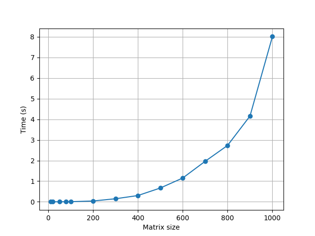

Основы параллельных вычислений — Лабораторная работа 1

Задание:
Написать программу на языке C/C++ для перемножения двух квадратных матриц.
Исходные данные: файл(ы) содержащие значения исходных матриц.
Выходные данные: файл со значениями результирующей матрицы, время выполнения, объем задачи.
Обязательна автоматизированная верификация результатов вычислений с помощью сторонних библиотек или стороннего ПО (например на Matlab/Python).

Структура проекта:
graph/graph_build.py - Python программа для построения графиков на основе данных полученных за время выполнения программы

matrix_generate/generate_matrices.py — Python программа для генерации матриц заданного размера в случайном диапазоне [-100; 100]

multiple/main.c — C программа для перемножения матриц

multiple/check.py — Python программа для запуска перемножения и автоматической проверкой через библиотеку NumPy

multiple/timing — файл с результатами скорости выполнения перемножения

multiple/mtrx — файл с исходными матрицами и полученными матрицами в результате выполнения программы

Шаг 1. Сгенерировать матрицы
graph_build.py
После запуска в multiple/mtrx появятся файлы с матрицами

Шаг 2. Запустить C программу
Открыть проект multiple/main.c и запустить его в среде Visual Studio Code
Собрать проект

Запустить main.exe

В программе задать размер матрицы, она автоматически посчитает матрицы и сохранит их в новый файл в mtrx с названием C(*заданный размер матрицы*) и выведет объем задачи и время подсчета, а также сохранит его в timing

Пример выполнения:
Matrix size: 100
Volume: 2000000
Time: 0.004000 seconds

Шаг 3. Проверка результатов
Для проверки используется файл check.py который при помощи библиотеки NumPy перемножает исходные матрицы и сравнивает результат с тем, который сохранила основная программа

Пример выполнения:
N = 100
Matrix size: 100
Volume: 2000000
Time: 0.004000 seconds
True

Шаг 4. Построить график времени
Результат:

